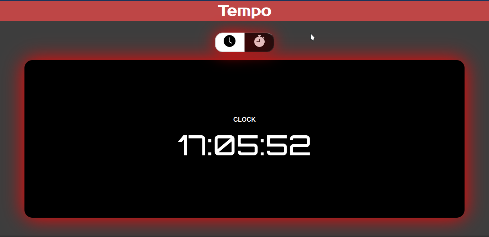
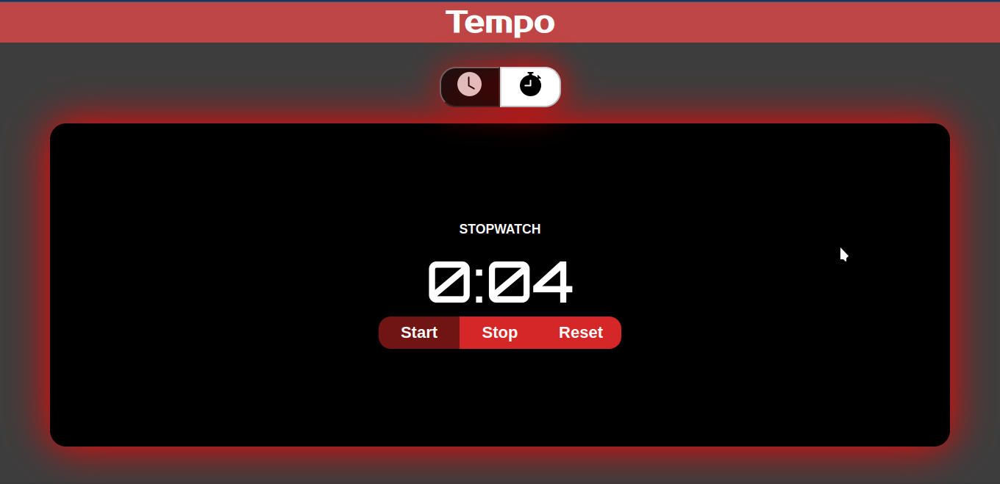

# Projeto Temporizador

## Resumo
Este projeto trata-se uma aplicação simples que permite o usuário ter acesso a um relógio, em tempo real, e um cronometro tradicional com suas funcionalidades.

 

## Sumário
[Explicação](#explicação)

[Tecnologias e Ferramentas](#tecnologias-e-ferramentas)

 

## Explicação

  
  

 

O projeto <strong>Temporizador</strong> foi criado com o objetivo de por em prática alguns dos conhecimentos de desenvolvimento <em>Frontend</em>. Esta aplicação não utiliza elementos com grande complexidade, porem pode ser um pouco desafiador a sua lógica, design ou estrutura.

Ao entrar na aplicação, o usúario que estiver na Pagina Home terá acesso a um relogio digital que, após um segundo, mostrará o horário de brasília em tempo real. Nesta pagina, contem dois botões que ao clicar no que esta a direita o usuario será direcionado para a rota '/timer', onde o mesmo terá acesso a um cronômetro totalmente funcional e manipulável. E caso preferir voltar ao relógio, basta clicar no botão que está na esquerda acima do cronômetro.

<strong>OBS:</strong> Neste projeto, utilizei testes de Integração 

 

## Tecnologias e Ferramentas
Essas foram as tecnologias ou ferramentas usadas durante o desenvolvimentos:

- VS Code
- Javascript
- React funcional
- React Router Dom
- Jest com RTL
- CSS
